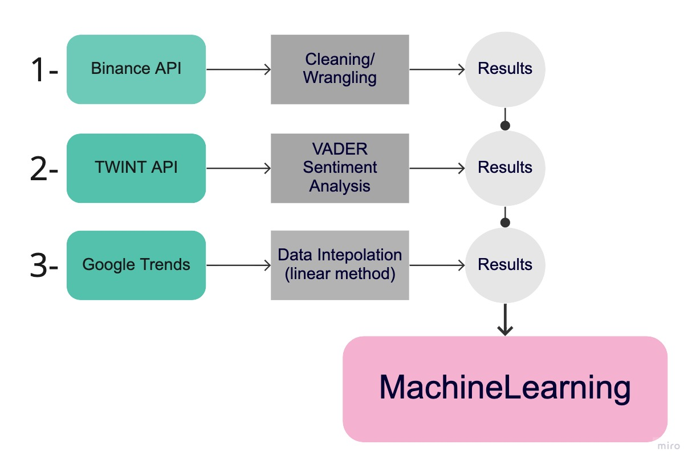

# Ethereum price prediction with Social network and trends data

## Andrea Tognoli
### *May 2021*

Project exploring Data Collection, Visualisation and Prediction of crypto-stock price.

## Content

- [Project Outline](#project-outline)
- [The Data](#the-data)
- [The Database](#the-database)
- [Visualisation](#visualisation)
- [Statistical Analysis](#statistical-analysis)
- [Delivering Insight](#delivering-insight)
- [Review](#review)

## Project Outline

This project aim to explore techniques to predict prices of Ethereum using ML as well as twitter and Goolge trends data. Ethereum is the second bigger cryptocurrency in terms of market capitalisation as well as the pyoneer of the smart contract technology. As a fact, social media are influencing more and more 
people decision on a daily basis and probably our investment choices too. Does it work also viceversa? 

*QUESTION:* "Can information in the social network environment can be use as a feature to predict cryptocurrecies prices?"

In order to answer to our question we will:
- scrape Twitter using the Twint API
- Get and adapt Google data
- Use Binance API 
- ML models to make predictions

