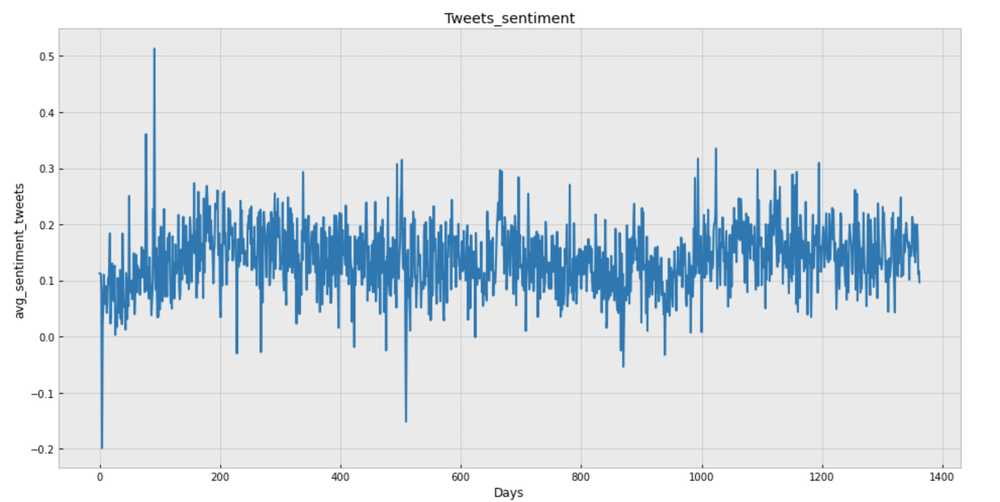
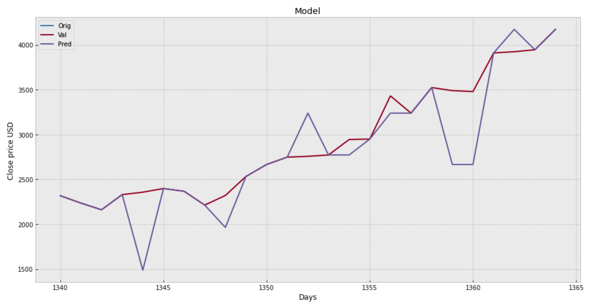
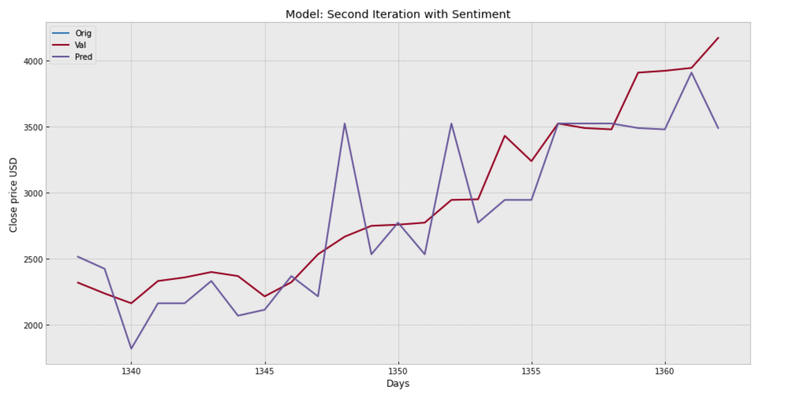

# Ethereum price prediction with Social network and trends data

## Andrea Tognoli
### *May 2021*

Project exploring Data Collection, Visualisation and Prediction of crypto-stock price.

## Content

- [Project Outline](#project-outline)
- [The Data](#the-data)
- [Sentiment Analysis](#sentiment-analysis)
- [Machine Learning](#machine-learning)
- [Delivering Insight](#delivering-insight)
- [Review](#review)

## Project Outline

This project aim to explore techniques to predict prices of Ethereum using ML as well as twitter and Goolge trends data. Ethereum is the second bigger cryptocurrency in terms of market capitalisation as well as the pyoneer of the smart contract technology. As a fact, social media are influencing more and more 
people decision on a daily basis and probably our investment choices too. Does it work also viceversa? 

*QUESTION:* "Can information in the social network environment can be use as a feature to predict cryptocurrecies prices?"

In order to answer to our question we will:
- scrape Twitter using the Twint API
- Get and adapt Google data
- Use Binance API 
- ML models to make predictions

## The Data

### Stock Historical price - timeseries
With a huge amount of data available, I explored a number of different sources that I could use to collect it. There are a number of crypto exchange statistics APIs, but many of the better ones require a paid licence key. I found the best sources for data were either Binance. Kraken or Geko. I opted for Binance which I consider easier to use and offer a function for csv download. The data I decided to scrape have a time window which goes from 17-8-2017 (ETH listed on binance for first time) to 11-5-2021.

### Tweets data
Since most of the famous twitter scraping API offer scraping only for limted amount of time or have huge liimits I opted for the less famous Twint API. Thanks to it I could scrape 113.000 tweets for from 17-8-2017 to 11-5-2021. The Tweets were cleaned using regex and some duplicates removed. 

Using Python I was able to automate the process of collecting and combining data from numerous days. I scraped a number of different tables into Pandas Dataframes and began to explore and clean the data. 

### Google trends

Google trends data were scraped from the analysed period and  saved into a csv file. Unfortunately Google allow to scrape data only in a weekly format if the timeframe is greater than 90 days. A data linear interpolation technique of Pandas helped me to transform my weekly data into daily ones. 

## Sentiment Analysis 

The goal of the analysis was to obtain a daily mean sentiment of the tweets scraped. In oreder to run the analysis we used the Vader library.

The first step of the process was to clean the data. Multile regex lines of code were used to remove re-tweets, websites, names, etc. from the tweets. Later also stop words and neutral parts of the tweets were removed. 

At the end of the process we got a list of compound polarity, one for each tweet. Eventually, the values of this list were grouped by dates and stored in a df in Pandas.

## Machine Learning
All the model will aim to predict the price with 25 days of advance. The method used are linear regression and tree classifier.

### First iteration
In the first iteration the model uses close time as feature to predict the target. The results:

### Second iteration
In the second iteration the model uses close time and sentiment as feature to predict the target. The results are slightly worse than in the previous model.

